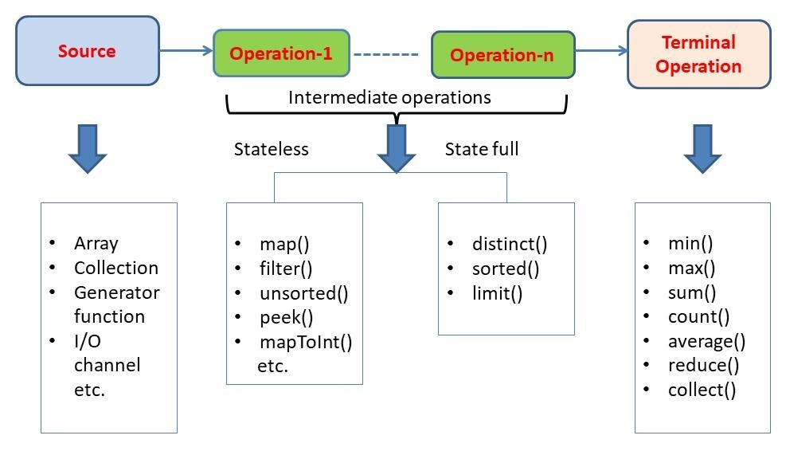

# Java 8 Streams

## Official Java Stream Package [here](https://docs.oracle.com/javase/8/docs/api/java/util/stream/package-summary.html)
https://docs.oracle.com/javase/8/docs/api/java/util/stream/package-summary.html

### Pipelines and Streams

A pipeline is a sequence of aggregate operations. 
A stream is a sequence of elements. Unlike a collection, it is not a data structure that stores elements. Instead, a stream carries values from a source through a pipeline. 

Stream pipeline
A Stream pipeline consists of a stream source zero or more intermediate operations and a terminal operation. Figure 1 shows the components of a stream pipeline.

**Source** - 
The stream can be created from the array, Set, List, Map or any Collection, any generator function like a random function generator, from a file or any IO channel, some computational pipeline.

**Intermediate operation** - 
From a source, a stream of elements is generated on which some operations are applied to achieve the desired result. In a stream pipeline, there can be one or more intermediate operations. Intermediate operations can be of two types stateless and stateful. Each intermediate operation consumes a stream and produces another stream as per the implemented logic.

**Stateless operations** - 
Operation’s which doesn’t require to maintain the state of the stream and has nothing to do with the other elements of the stream, Operations like map (), filter () mapToInt (), mapToDouble(), peek(), unsorted(), etc.

**Stateful operations** - 
Operations in which elements can’t be processed individually and they are required to do some comparison with other elements, like distinct (), sorted (), limit (), etc.

**Terminal Operations** - 
In a stream pipeline there can be only one terminal operation that produces some desired single result or side effect, it consumes a stream but doesn’t produce a stream. Example terminal operations min() , max(), sum(), average(), collect(), for Each(), reduce() etc.

### Stream Creation ### 

There are many ways to create a stream instance of different sources. Once created, the instance will not modify its source, therefore allowing the creation of multiple instances from a single source.

**Empty Stream**
We should use the empty() method in case of the creation of an empty stream:

Stream<String> streamEmpty = Stream.empty();

